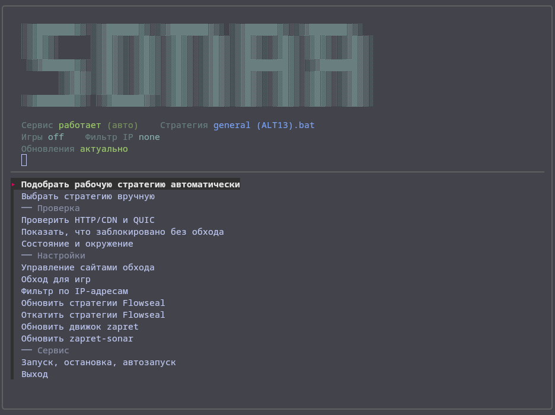
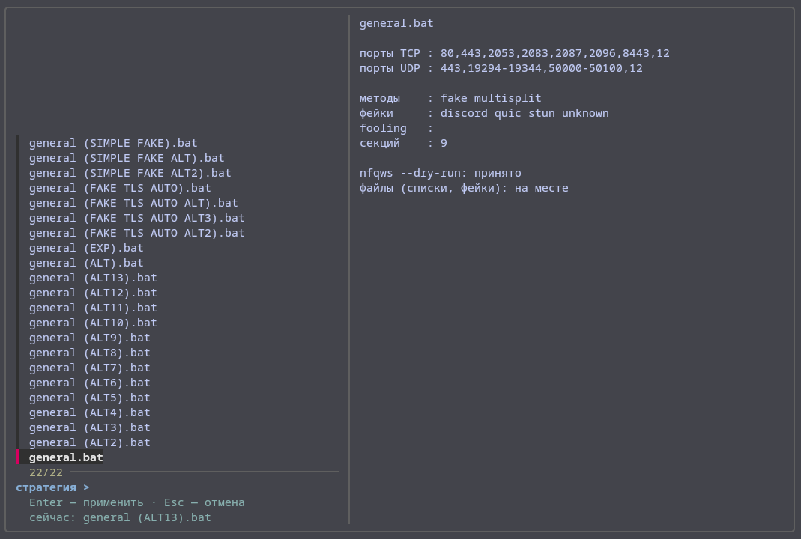
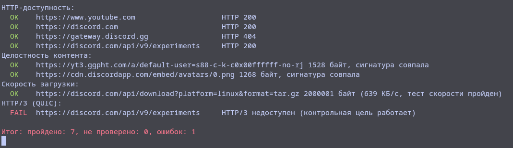
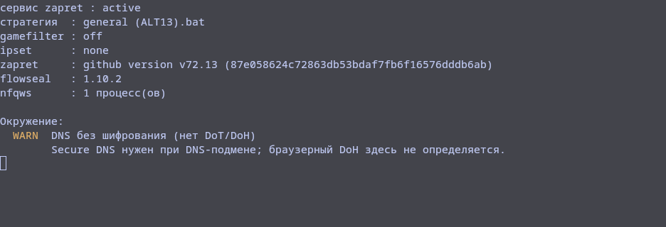
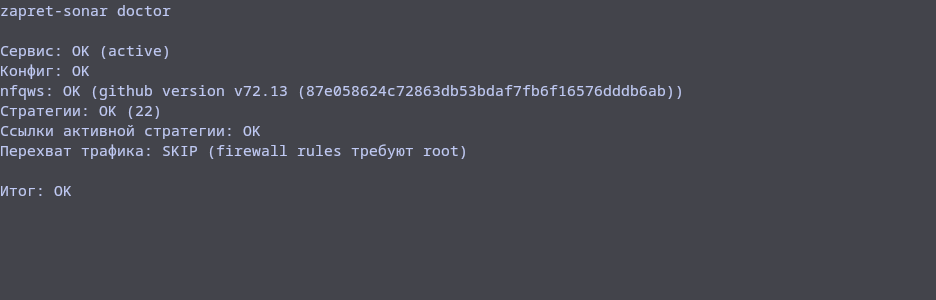

# zapret-sonar

[Русский](README.md) | [English](README.en.md)

<p align="center">
  
</p>

A Linux wrapper for [zapret](https://github.com/bol-van/zapret) v1 and [Flowseal](https://github.com/Flowseal/zapret-discord-youtube) strategies. It translates Flowseal `.bat` strategies into `nfqws` arguments and manages installation, selection, checks, and updates.

> zapret v1 is in EOL mode: upstream only provides bug fixes. zapret2 is not supported yet and is being investigated separately.

## Quick start

```bash
git clone https://github.com/zero-oxygen/zapret-sonar.git
cd zapret-sonar
sudo ./install.sh
sudo sonar try --keep
sonar check
sudo sonar enable
```

`try --keep` keeps the first strategy that passes the HTTP checks without detected regressions. It is not guaranteed to be the objectively best strategy for every site or protocol. `enable` enables autostart for the configured service.

On servers and remote hosts, `try` temporarily stops and repeatedly restarts the service, so active connections may be interrupted.

## What it is and is not

- A GNU/Linux tool built around `systemd`, `nfqws`, and nftables.
- Not a VPN or proxy: traffic is not routed through a third-party server.
- Not an independent strategy collection: strategies and lists come from Flowseal.
- Results depend on the provider, blocking method, and protocol.
- Do not install it over another zapret deployment: processes and NFQUEUE rules will conflict.
- To explicitly migrate a plain zapret v1 deployment, use `sudo env MIGRATE_ZAPRET=1 ./install.sh`; otherwise the installer stops.
- `sonar check` tests specific HTTP/CDN targets. Success does not prove that Discord Voice, QUIC, YouTube video, or zapret itself is working.

## If it does not work

```bash
sonar doctor
sonar status
sonar baseline
sonar log
```

`baseline` temporarily stops an active service, measures connectivity without bypass, and restores the previous service state.

Also check:

1. Secure DNS. DoT/DoH is recommended and required when your provider tampers with DNS. `sonar status` detects system-wide DoT via `systemd-resolved`, but not browser DoH.
2. IPv6. The generated config uses `DISABLE_IPV6=1`; working IPv6 may bypass `nfqws`.
3. Tunnels. A client-side full tunnel may route checks around local `nfqws`. A server-side WG/AWG interface intentionally forwarded through NFQUEUE is not an error by itself.
4. If no strategy works, use `/opt/zapret/blockcheck.sh` for deeper parameter testing.

## Requirements

- GNU/Linux with `systemd`;
- bash 4+, curl, tar, sha256sum, flock, iproute2, and standard GNU coreutils/findutils/grep/sed;
- nftables (recommended), or iptables together with `ipset` and `ip6tables`;
- `restorecon` from policycoreutils on systems with SELinux enabled;
- `unzip` only for the Flowseal branch fallback;
- fzf for the optional TUI;
- git for the installation method shown above.

Bash completion: `source contrib/bash-completion.sh` or install the file system-wide as `/etc/bash_completion.d/zapret-sonar`.

Installation, reinstallation, service management, and uninstall are tested on Ubuntu Server 26.04 LTS, Arch Linux, and Fedora 44 (x86_64). The matrix covers nftables, iptables-legacy with ipset, and Fedora with SELinux enforcing.

## Commands

### Strategy selection

| Command | Purpose |
|---|---|
| `sonar list` | List strategies (`*` marks the active one) |
| `sudo sonar use alt12` | Apply a strategy by full name or unique substring |
| `sudo sonar try [--keep]` | Sweep strategies; `--keep` keeps the first passing one |
| `sonar baseline` | Measure targets without bypass and safely restore the service |

### Diagnostics

| Command | Purpose |
|---|---|
| `sonar check [--json]` | Check HTTP/CDN targets; output tracks `passed`, `failed`, and `skipped` |
| `sonar doctor` | Check the service, config, nfqws, and active strategy; `sudo sonar doctor` also verifies firewall interception |
| `sonar status [--json]` | Show state, modes, and versions; JSON excludes preflight checks |
| `sonar validate [--json]` | Validate every strategy through translation and `nfqws --dry-run` without applying it |
| `sonar export-diagnostic [--output file]` | Safe issue JSON without raw config, logs, addresses, or user lists |
| `sonar log [-f] [period]` | Show the systemd journal |
| `sonar --debug <command>` | Enable shell tracing and verbose curl output |

`PASS` means that a specific check succeeded, `FAIL` means it failed, and `SKIP` means that the target could not produce a meaningful result. Skipped checks are not counted as passed but do not fail the command by themselves; a non-zero exit code is returned when any check reports `FAIL`.

The process exit status matches the command result: `0` means success and a non-zero status means a failed check or operation. JSON commands preserve this contract and are safe to use in monitoring and automation.

### Configuration

| Command | Purpose |
|---|---|
| `sonar site <domain>` | Add a domain; run `sudo sonar restart` afterward |
| `sonar site --list` | List user domains |
| `sonar site --remove <domain>` | Remove a domain; run `sudo sonar restart` afterward |
| `sudo sonar gamefilter off\|tcp\|udp\|both` | Configure game ports and apply immediately |
| `sudo sonar ipset none\|any\|loaded` | Change IP filtering; run `sudo sonar restart` afterward |

### Updates and service

| Command | Purpose |
|---|---|
| `sudo sonar update [--force]` | Update Flowseal strategies, lists, and `.bin` payloads |
| `sudo sonar upgrade [--force]` | Update `nfqws`, `ip2net`, and `mdig` with SHA-256 verification |
| `sonar self-update [--force]` | Update zapret-sonar from a release asset with SHA-256 verification and rollback |
| `sonar snapshots [--json]` | List the current and rollback Flowseal snapshots |
| `sudo sonar rollback [snapshot]` | Switch to the previous or selected Flowseal snapshot |
| `sudo sonar start\|stop\|restart` | Control the service |
| `sudo sonar enable\|disable` | Control autostart |
| `sudo sonar uninstall` | Remove the service and the entire `/opt/zapret` tree |

## TUI

```bash
sonar-tui
```

The fzf-based TUI shows service and update state, provides strategy previews, runs checks, and changes settings. Update checks do not block the interface: on a cold cache the header automatically changes from “checking…” to the result. Live header updates require an fzf version with `bg-transform-header`; older versions update after the menu is redrawn.

The settings section can add, list, and remove user sites, update Flowseal, roll snapshots back, and update both the engine and zapret-sonar itself.



<details>
<summary>More screenshots</summary>









</details>

## How it works

```text
Flowseal .bat -> translate.sh -> NFQWS_OPT -> nfqws --dry-run -> config -> systemctl restart
```

1. `lib/translate.sh` extracts `winws.exe` arguments, adapts paths, and discards Windows batch commands.
2. The result is checked for shell metacharacters because the config is sourced as root.
3. `nfqws --dry-run` validates arguments and referenced files before the config changes.
4. The config is written atomically and stores the selected strategy and modes.
5. The service is restarted only after successful validation; the previous config and service state are restored on failure.

## Updates and recovery

- A Flowseal tree is assembled in staging and activated as a whole through the `flowseal-current` symlink.
- The version is committed and old snapshots are removed only after the active strategy has been applied successfully.
- On failure, the previous tree is restored, config and service are verified again, and incomplete recovery is reported explicitly.
- Reinstallation rebuilds a legacy config with the new paths before deleting old directories.
- The installer and engine updater create backups and restore the previous state on failure; a service that was stopped before an engine update remains stopped.
- The background update check stores its user cache in `${XDG_CACHE_HOME:-~/.cache}/zapret-sonar`; mutating operations use a root-owned lock under `/run/zapret-sonar`.

If Flowseal is temporarily unavailable, the active tree keeps working. List retained versions with `sonar snapshots` and switch with `sudo sonar rollback [snapshot]`. For a full zapret-sonar reinstall, use a checkout or source archive of the required GitHub tag and run `install.sh`; the `zapret-sonar-v*.tar.gz` runtime asset is for `sonar self-update` and does not contain the installer. The installer preserves the active service config.

## Security

- Installed files under `/opt` are root-owned; sudoers is not modified.
- The executable shell config is generated only from sanitized strategy data.
- zapret binaries are verified against the upstream release `sha256sum.txt`.
- Self-update uses a dedicated release archive and `SHA256SUMS`, validating structure and syntax before an atomic version switch.
- The release asset is built reproducibly only after the exact tag commit passes the test suite. The workflow creates a draft release; after its Russian-first notes are reviewed, it is published manually and makes its tag and assets immutable.
- Flowseal does not publish a checksum file; its archive is fetched over TLS and validated structurally.
- All operations that mutate config, lists, snapshots, binaries, or service state use one root-owned lock.

## Check limitations

- YouTube throttling on `googlevideo.com` is not measured reliably.
- Discord Voice and other UDP scenarios are not tested.
- QUIC/HTTP3 is not tested.
- curl ClientHello differs from browser traffic, including multi-packet TLS.
- `check` can pass without zapret when targets are already reachable; `try` performs a differential comparison against baseline.

## Uninstall

`sudo sonar uninstall` removes the service, unit, firewall rules, symlinks, and all of `/opt/zapret`, including `config`, `config.orig`, snapshots, and user `*-user.txt` files. Back up anything you need first.

## Project layout

```text
zapret-sonar                 CLI
zapret-sonar-tui             fzf TUI
install.sh                   installer
lib/translate.sh             .bat -> NFQWS_OPT parser
lib/zconfig.sh               config generation and ipset modes
lib/health.sh                HTTP/content checks, baseline, and scoring
lib/flowseal.sh              staging, activation, rollback, and pruning
tests/                       smoke, safety, and pinned Flowseal tests
tests/vm/                    lifecycle tests in isolated VMs
schemas/                     versioned JSON Schemas for machine-readable output
scripts/build-release.sh     verified release asset builder
.github/workflows/ci.yml     ShellCheck, syntax, and regression tests
contrib/bash-completion.sh   bash completion
```

## Credits

- [bol-van/zapret](https://github.com/bol-van/zapret) — DPI bypass engine
- [Flowseal/zapret-discord-youtube](https://github.com/Flowseal/zapret-discord-youtube) — strategies

## License

MIT
